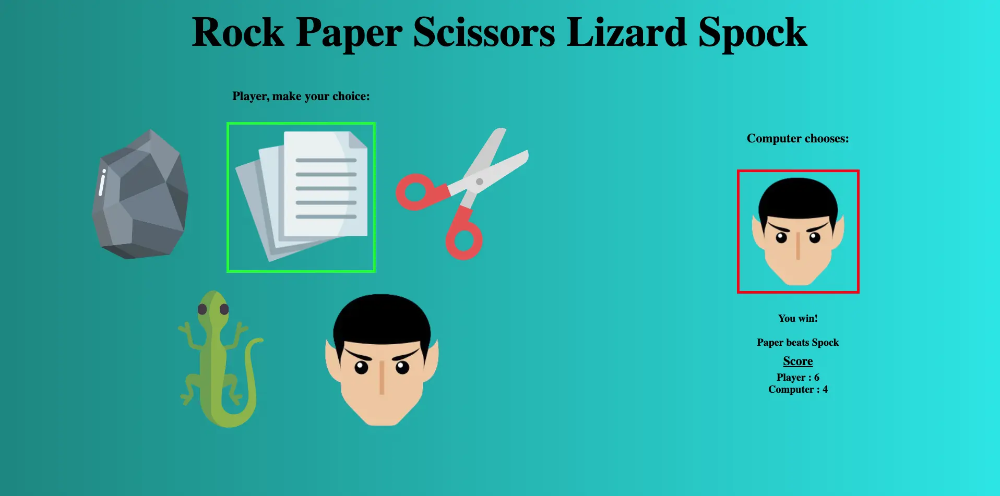
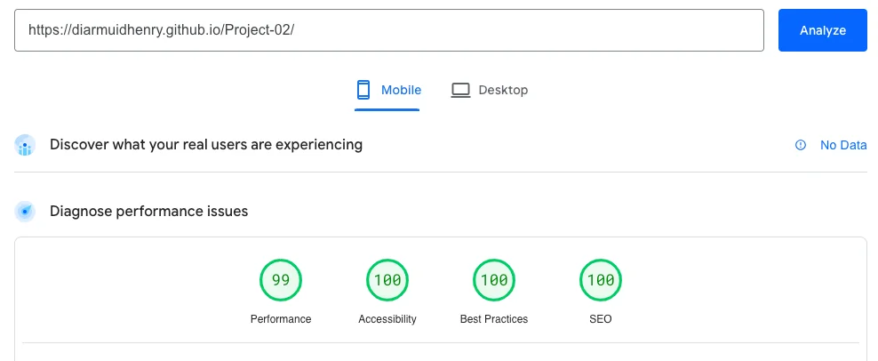

# Rock Paper Scissors Lizard Spock Website - PP2<!-- omit from toc -->

This project is a website where users can play the game Rock Paper Scissors Lizard Spock.

The game is clear and easy to understand, both for those who are familiar or unfamiliar with 
the game and its history/structure.

Pictures, unambiguous instructions and clear text make it easy to navigate and play, 
whilst emotive messages, coloured results and changing images invoke emotive responses from users as they play.

[Deployed Website](https://diarmuidhenry.github.io/Project-02/)

## Table of Contents<!-- omit from toc -->
- [Introduction](#introduction)
  - [History](#history)
  - [Game Theory](#game-theory)
- [Aim](#aim)
  - [Website Objective](#website-objective)
  - [Key Features](#key-features)
- [Potential Users](#potential-users)
  - [User Goals](#user-goals)
  - [User Testimonials](#user-testimonials)
- [Design \& Development](#design--development)
  - [5 Planes of UX](#5-planes-of-ux)
    - [Strategy](#strategy)
    - [Scope](#scope)
    - [Structure](#structure)
    - [Skeleton](#skeleton)
    - [Surface](#surface)
  - [Wireframes](#wireframes)
    - [Desktop \& Tablet](#desktop--tablet)
    - [Mobile](#mobile)
  - [Features](#features)
- [Technology \& Resources](#technology--resources)
- [Deployment](#deployment)
- [Issues/Bugs](#issuesbugs)
  - [Resolved](#resolved)
  - [Unresolved](#unresolved)
- [Testing \& Validation](#testing--validation)
  - [Functional Testing of Website](#functional-testing-of-website)
    - [Home Page](#home-page)
    - [Player v Computer (PvC)](#player-v-computer-pvc)
    - [Player v Player (PvP)](#player-v-player-pvp)
  - [Browser Testing](#browser-testing)
    - [Mozilla Firefox](#mozilla-firefox)
    - [Safari](#safari)
    - [Microsoft Edge](#microsoft-edge)
    - [Opera](#opera)
  - [WAVE Evalutation Tool](#wave-evaluation-tool)
  - [PageSpeed Insight Tests](#pagespeed-insight-tests)
  - [HTML Code Validation](#html-code-validation)
  - [CSS Code Validation](#css-code-validation)
- [Future Improvements/Development](#future-improvementsdevelopment)

## Introduction

### History

The game was originally created by a software engineer named Sam Kass in 1998, who [outlined the rules
on his website](http://www.samkass.com/theories/RPSSL.html). It gained popularity on an episode of
The Big Bang Theory entitled - quite appropriately - "The Lizard-Spock Expansion". Sheldon Cooper (played by Jim Parsons)
rightfully explains that is in an expansion on the classic Rock Paper Scissors, often used to settle minor disoputes:

"Scissors cuts paper, paper covers rock, rock crushes lizard, lizard poisons Spock, Spock smashes scissors, scissors decapitates lizard, lizard eats paper, paper disproves Spock, Spock vaporizes rock, and as it always has, rock crushes scissors."

The game quickly gained popularity online, where it has appeared in many articles, social media posts, and even on various pieces of merchandise such as tshirts and mugs.

### Game Theory

Instead of there being only 3 possible non-draw results - Rock v Paper, Paper v Scissors, Scissors v Rock, and vice versa for each pair - the addition of the 2 extra choices - Lizard, Spock - increases this number to 10. In mathematical terms, it increases from $\binom{3}{2} = \frac{3 \times 2}{2 \times 1} = 3$ to $\binom{5}{2} = \frac{5 \times 4}{2 \times 1} = 10$.

We can start by analysing the original 3-choice game.

Rock Paper Scissors give each player 3 options. The opponent also has 3 options. Each option loses against 1, wins against 1 and draws against 1 (itself).

Rock Paper Scissors Lizard Spock works from a similar principal, but there are 5 choices. This leads to each choice losing against 2, winning against 2, and of course drawing against 1 (itself).

This can easily be generalised to a game with $2n+1$ choices, where each choice loses against $n$, wins against $n$, and draws with 1 (itself). Here for the game to be non-trivial, we must have that $n > 0$.

By ordering these $2n+1$ items in a certain way, we can assure that each choice beats the following $n$ choices and loses to the preceeding $n$ choices. Here, we work modulo $n$. For example, if we have 9 choices (named 0-8 for simplicity when recalling items by index), then choice 7 would lose to 3, 4, 5 and 6, whilst it would win against 8, 0, 1 and 2.

Using this theory, we can quickly relabel our choices, and simplify the problem into a general game of $2n+1$ choices. This means that we can add superficial names/labels to a large number of choices and use them as our return, since all of the workings are done with our newly constructed sets.

By using this approach, this code can easily be adapted to a game with 7, 9, 11, 101 choices, with a similar structure. For example, for a game with 101 choices, there would be $\binom{101}{2} = \frac{101 \times 100}{2 \times 1} = 5050$ possible pairs of choices. Instead of having to write out all 5050 pairs of results, you would only need to upload the releveant 101 images, and define the `choices` array once.

## Aim

### Website Objective

- To create a a website where a user/users can easily play Rock Paper Scissors Lizard Spock online. The page should be clear, uncluttered, uncomplicated, and there should be no doubt as to what the purpose of the page is. Instructions should be available for those who need them, and the flow of the game should be prompted clearly and obviously to the user/s.

- Simple, clear icons and a straightforward colour scheme will help the user to focus on the game and will avoid distractions during gameplay.

### Key Features

- The *Home* page will include an *Instructions* drop down text box, instructing those who are unfamiliar with the game on how the game works, as well as the website.

- There will be a *Play against the computer* option where a user can play against a computer whose choices are randomly generated.

- There will also be a *Play against a friend* option, where 2 users - using the same device - can play against each other, without being able to see what the other person has chosen.

## Potential Users

The website would be of interest to anyone who has seen/heard of the game through the Big Bang Theory episode. It will also be of interest for anyone who is with a friend, looking for a simple 2 player game that can be easily and fairly played on a single device.

### User Goals

- **Entertainment**: The primary goal of users engaging with the Rock Paper Scissors Lizard Spock game is to have a fun and entertaining experience.

- **Skill Development**: Users may aim to enhance their strategic thinking and decision making skills by playing the game regularly.

- **Friendly Competition**: Engage in friendly competition with friends or family, fostering a sense of camaraderie and sportsmanship.

- **Learn the Game Rules**: Understand and learn the rules of the extended Rock Paper Scissors Lizard Spock game, with the clear explanations provided in the *Instructions* section.

- **Accessible Gameplay**: Experience a user-friendly interface that ensures smooth gameplay, making it enjoyable for users of all ages and skill levels.

### User Testimonials

__Emily, Casual Gamer__ \
"I stumbled upon this Rock Paper Scissors Lizard Spock game whilst looking for a quick and fun way to unwind. The gameplay is intuitive, and I love the clear use of icon images. Highly recommended!"

__Alex, Strategy Enthusiast__ \
"As a strategy game enthusiast, I appreciate the depth this extended version of Rock Paper Scissors brings. The inclusion of Lizard and Spock adds a layer of complexity that keeps me engaged. The user interface is clean, and the multiplayer option lets me test my skills against others. A great choice for those who enjoy a mix of strategy and classic gaming."

## Design \& Development

### 5 Planes of UX

#### Strategy

Create a simple, engaging Rock Paper Scissors Lizard Spock game site, including single and multiplayer experiences with user-friendly accessibility.

#### Scope

Include a Player v Player, as well as a Player v Computer part to the game. Use clear images to help show the user results, as well as to guide them through the process of the game.

#### Structure

A *Home* page where user/s can either choose to read instructions, or they can choose to start a game. Once they choose which game to start, they are guided through each round by messages and icons appearing on screen determined by their choice and either their friend's choice or the computer's choice, depending on the game. Once the game has been won/lost, the user returns to the *Home* screen, where the result is clearly shown, and they can start another game.

#### Skeleton

A simple title and 3 buttons(*Instructions*, *Play against the computer* and *Play against a friend*) appear when the pages loads. As gameplay commences, icons clealy representing the 5 choices appear for the user/s to choose from. All choices chosen are clearly shown, and results are clearly displayed for each round, as well as an overall score.

See [Wireframes](#wireframes) below.

#### Surface

A simple, two toned colour scheme is used throughout, to avoid distracting the user's focus from the game area. All clickable buttons and icons will highlight when hovered over, in order to show where the user can and cannot click. Icons will show frames to represent results: green symbolising a win, red symbolising a loss and grey symbolising a draw.

### Wireframes

#### Desktop \& Tablet

 

 

 

#### Mobile

 

### Features

The initial page gives the user the option to read the instructions, start a game against the computer or start a game against a friend.

 

The *Instructions* page explains how the game and the website works, including a large, clear image showing the winning/losing combinations.

The Player v Computer (PvC) game gives instant feedback about the result of each round by using bold, clear colours to highlight the users choice and the result.

 

The winner of the game is then clearly shown and the user returns to an updated homescreen.

 

The Player v Player (PvP) game splits each round using more prompts, ensuring that neither player can see the other's choices.

Similarly to the PvC game. the winner of the game is then clearly shown and the users return to an updated homescreen.

 

## Technology \& Resources

- **IDE :** [CodeAnywhere](https://app.codeanywhere.com/) and [Visual Studio Code](https://code.visualstudio.com/).
- **Languages :** HTML for basic page structure. CSS for styling. JavaScript for interactivity and execution of gameplay. Markdown for this readme.
- **Template :** The [CodeInstitute template](https://github.com/Code-Institute-Org/ci-full-template) was used in order to install all the relevant tools for the code to function.
- [Github](https://github.com/) was used to host the project. I used `git commit` regularly to create versions of the project at regular intervals. This meant that I could be more precise if I needed to `git reset`.
- [Balsamiq](https://balsamiq.com/) was used to create wireframes for mobile, tablet and desktop.
- [Favicon.io](https://favicon.io/favicon-generator/) was used to find the page's favicon.
- [WAVE](https://wave.webaim.org/) and [PageSpeed Insights](https://pagespeed.web.dev/) testing tools were used to locate minor issues and check both accessibility and performance. 

## Deployment

Once the basic design of the website was finished, I deployed it to GitHub Pages. [The history of all deployed versions of the site can be found here](https://github.com/DiarmuidHenry/Project-02/deployments).

### How to Deploy to GitHub Pages

1. Log in to [GitHub](https://github.com/).
2. Select *Project-02* in my list of repositories.
3. Click Settings > Pages.
4. Under *Source*, select *Deploy from a branch*.
5. Under *Branch*, select *main* and */root*, then click *Save*.
6. Wait a couple of minutes for the site to deploy, then navigate back to the repository.
7. Click *Deployments*, which now should have appeared on the main repository page.
8. Under *Active Deployments*, click the link https://diarmuidhenry.github.io/Project-02/. (The deployed page will open in the current tab).

### How to Clone Repository

1. Go to the [GitHub repository](https://github.com/DiarmuidHenry/Project-02/).
2. Click the green *Code* drop-down button.
3. Click *HTTPS* and copy the URL.
4. Open your IDE, and open a terminal.
5. Type `git clone url`, replacing `url` with the URL copied in step 3.

## Issues/Bugs

### Resolved

- _Unclear Game Count_

Whilst looking at my game with my mentor, I found that he often needed reminding how many points you would need to score in each game to win. Although this information is in the *Instructions* section, it made me realise that making it clearer on the start game buttons would be helpful to the user. This just involved putting a span in each of the relevant buttons and styling it so that the text was in italics, slightly smaller and with slightly smaller weight.

- _Multiple Borders_

Borders applied (`win-border`, for example) were not disappearing after the next choice was clicked. In the below example, we can see that several icons still have the `lose-border` styling applied.

I solved this by adding a style class remover to remove the border style of any buttons as soon as the next one was chosen.

- _Incorrect Score Count_

After a game ended and scores were reset, scores in the next game went up by more than 1 point at a time. This was due to multiple eventListeners being attached to each image/button. The example below shows 2 screenshots taken 1 click apart, which should mean an increase of 0 or 1 in the score, but a difference of 2 is seen.

I solved this by moving the event listeners from inside the `startComputerGame` function to inside the `runGame` fucntion, so they only were added once on loading the DOM.

- _Conflicting Specificity_

When adding media queries, I was having problem with specificity. I found out that this was because my approach to it was to add styles directly into the HTML from javascript. This meant it could not be overwritten, as `style = ""` has the highest specificity. I tried first to fix this by altering the way I changed the display property: I created style classes called `.display-flex`, `.display-block` and `.display-none` in `style.css` and added this style class to the object. However, this didn't work, as I had more specific changes to the display based on id in other places in the code. I finally solved it by altering the `changeDisplayById` function to include the media query in itself. This way, I avoided having excessive usage of `!important` and I didn't have to do a large restructure of the CSS styling.

- _Poor View on Mobile Devices_

When playing on mobile devices, the results pages became either too long to fit on the screen, or the font became too small to read comfortably.

I fixed this by changing the display style to `grid` and organised the elements in this new way. I then created the `gridOrFlex` function to decide when to use this layout. This meant I could better make use of the horizontal space on the device. The example shown is for the PvP game.

### Unresolved

- The overall styling of the page. Although this is not technically a bug, it is something that I feel can be improved on. However, for the purpose of this project, I feel that the time investment necessary to make the page look and feel as clean and comfortable as I would like would not give a significant difference to the overall feel (and grade) of the website.

## Testing \& Validation

### Functional Testing of Website

#### Home Page

|Test Item|Test Carried Out|Result|Pass/Fail|
|-------------|------------------|-----------|-------|
|Button hover background|Hover over any button/anchor|The background of the button fades to a darker colour|PASS|
|*Instructions* button|Click on *Instructions* button|The drop down text appeared along with the image. The text in the button changed to *Return to game*|PASS|
|*Return to game* button|Click on *Return to game* button|The drop down text disappeared. The text in the button changed back to *Instructions* and the 2 game start buttons appear|PASS|
|Page heading/title|Click on *Rock Paper Scissors Lizard Spock* heading|Homepage reloads|PASS|
|*Play against the computer* button|Click on *Play against the computer* button|Player v Computer game loads correctly and starts|PASS|
|*Play against a friend* button|Click on *Play against a friend* button|Player v Player game loads correctly and starts|PASS|

#### Player v Computer (PvC)

|Test Item|Test Carried Out|Result|Pass/Fail|
|-------------|------------------|-----------|-------|
|Page heading/title|Click on *Rock Paper Scissors Lizard Spock* heading|Homepage reloads|PASS|
|Choice images response|Click on player choice icon|The game accepts this as the player's choice|PASS|
|Win/Lose/Draw border - Player|Click on player choice icon|The relevant border colour appers on the player's choice|PASS|
|Computer's random choice|Click on player choice icon|The computer's choice appears. From repeating the test, I can see it is being randomly assigned|PASS|
|Win/Lose/Draw border - Computer|Click on player choice icon|The relevant border colour appers on the computer's choice|PASS|
|Result message|Click on player choice icon|Message appears with the correct result and the correct names of both the player and computer's choices|PASS|
|Scoreboard Updating|Click on player choice icon|Game score is updated correctly for win/lose/draw|PASS|
|Game Ending|Play multiple rounds until a score reaches 10|When first score reaches 10, players choice buttons disable, score shows briefly, then user is brought to Homepage where the score and a win/lose message appears|PASS|

#### Player v Player (PvP)

|Test Item|Test Carried Out|Result|Pass/Fail|
|-------------|------------------|-----------|-------|
|Page heading/title|Click on *Rock Paper Scissors Lizard Spock* heading|Homepage reloads|PASS|
|Player 1 choice prompt|None: loads when game loads from homepgage|Prompt appears at start of game|PASS|
|Player 1 *Play* button|Click on *Play* button|Player 1's choices appear|PASS|
|Player 1 selection|Click on player 1 choice icon|The game accepts it as player 1's choice. The border of the selected icon appears white to indicate this. The choices then disappear and player 2 choice prompt appears|PASS|
|Player 2 *Play* button|Click on *Play* button|Player 2's choices appear|PASS|
|Player 2 selection|Click on player 2 choice icon|The game accepts it as player 2's choice. The border of the selected icon appears white to indicate this. The choices then disappear and the pre-results page appears|PASS|
|*RESULT* button|Click on *RESULTS* button|The result of that round appears.|PASS|
|Result message|Click on *RESULTS* button|Message appears with the correct result and the correct names of both player 1 and player 2's choices.|PASS|
|Win/Lose/Draw borders|Click on *RESULTS* button|The winning player's choice appears with a green border. The losing player's choice appears with a red border. In the case of a draw, both appear with a grey border|PASS|
|Scoreboard Updating|Click on *RESULTS* button|Game score is updated correctly for win/lose/draw|PASS|
|*Next Round* button|Click on *Next Round* button|The scoreboard and results disappear, and screen reverts back to player 1 choice prompt|PASS|
|Game Ending|Play mutiple rounds until a score reaches 3|When first score reaches 3, the *Next Round* button does not appear, score shows briefly, then users are brought to Homepage where the score and a win/lose message appears|PASS|

### Browser Testing

The above testing is performed using Chrome as the browser. These tests were repeated on the following browsers, all of which also passed in all criteria.

#### Mozilla Firefox

#### Safari

#### Microsoft Edge

#### Opera

### WAVE Evaluation Tool

WAVE revealed no errors and no contrast errors. As this needed to be tested throughout all moments of gameplay, no single screenshot could show this.

### PageSpeed Insight Tests

The page scored 100 on all metrics on computers and 96+ on mobile devices.

### JSHint

JSHint returned no errors, only 7 warnings about functions being contained within other functions. This is deemed acceptable for this project and so does not need addressing.

### HTML Code Validation

HTML Checker showed no warnings or errors.

### CSS Code Validation

W3C CSS Validator found no errors.

## Future Improvements/Development

- Extend the game so that players can upload their own icon images, or even just give names to their own custom choices. This could lead to a game where, for example, all 11 members of a football team could be choices, meaning the players in the team could play as themselves, against the others in the team. Due to the setup of the JavaScript code \(See [Game Theory](#game-theory) above\), this would be quite straightforward. However, changes/additions to styling would need to be made in order to fit the larger number of icons on screen.

- Improve on the styling and look of the page to make it look more professional.

- Include animation on the chosen icons, not just changing border styles.

## Acknowledgments

- Luke Buchanan: my mentor, for giving clear, constructive feedback during the entire process.
- The Slack community, for the plethora of questions that have been previously asked and answered.
- Tutor Assistance, for helping point me in the right direciton when discussing problems that I just couldn't get my head around.
